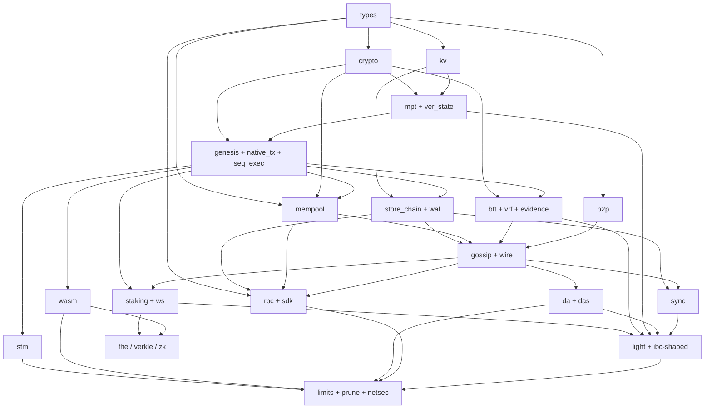

# L1 Development Plan

**Build order, dependency graph, and tiered delivery for a full-stack chain from this architecture.**

Source of truth for *what* to build: [`architecture.md`](./architecture.md).  
This document is the source of truth for *in what order* and *what “done” means* so nothing in that architecture is skipped or built on a missing foundation.

The workspace already has crate shells (`types`, `crypto`, `state`, `storage`, `execution`, `mempool`, `consensus`, `network`, `rpc`, `node`). Treat them as the intended package boundaries. Fill them in this order; add crates only when a boundary is real (`da`, `sdk` later).

---

## 0. How to read this plan

The architecture diagrams are **runtime data flow** (P2P → mempool → propose → execute → commit state → BFT → DA). That is *not* build order.

**Build the sequential state-transition spec first.** Parallel execution, gossip, and data-availability sampling are accelerators and distribution layers on top of a deterministic function:

```
apply_block(pre_state, block) → (post_state, receipts, app_hash)
```

Every later engine (Block-STM, WASM, FHE lane) must produce the **same** `app_hash` as this function for the same inputs. If that spec does not exist, parallelism and networking will hide consensus bugs.

**Static genesis validators first; staking second.** Tendermint can finalize with a frozen validator set. Bonding, unbonding, and epoch rotation are a *state machine module* that *feeds* the next validator set into consensus. Do not block the BFT engine on economics.

**In-process multi-validator before libp2p.** Drive N consensus engines on one machine over channels. Only then put the same messages on gossipsub. This isolates protocol bugs from network bugs.

---

## 1. Decisions the architecture leaves open (freeze these now)

These are required for a gapless implementation. Changing them after Tier 2 forks the chain.

| Topic | Decision for this chain | Why |
|---|---|---|
| Account tx signatures | Ed25519 | Simple, fast verify; distinct from validator BLS |
| Validator signatures | BLS12-381, aggregatable | Architecture §7 |
| Leader randomness | ECVRF; seed = `H(last_finalized_block_hash \|\| epoch)` | Architecture §2.3, grinding resistance |
| Content hash | BLAKE3-256, domain-separated prefixes | Architecture allows Keccak/BLAKE3; BLAKE3 is the internal primitive |
| Wire + storage codec | Canonical binary (length-prefixed protobuf *or* a frozen `bincode` schema with a version byte). JSON only at RPC. | Replay and hashing must be bit-stable |
| VM (contracts trie) | Native txs in Tier 2; **WASM** (gas-metered) in Tier 6 | Architecture has a contracts trie but no VM; WASM fits a Rust L1 without EVM opcode lock-in |
| Execution parallelism | Sequential spec is canonical; **Block-STM** (speculative) must match it | Architecture §3.4 |
| Consensus flavor | Tendermint round structure (propose / prevote / precommit / commit), not HotStuff pipelining, for MVP | Architecture §2.2; pipelining is a later latency optimization |
| KV | RocksDB behind a trait; in-memory impl for tests | Validator storage target §9 |
| P2P | rust-libp2p, QUIC transport, gossipsub, Kademlia | Architecture §5 |
| Time | Logical clock injected into consensus (timeouts); block `timestamp` bounded vs previous + max drift | Prevents timestamp grinding |
| Fees | Constant min gas price + priority by `fee/gas` for MVP; no 1559 until after networked MVP | Mempool DoS §5 |
| Privacy / Verkle / zk / IBC / encrypted mempool | After mainnet-shaped MVP | Architecture marks these as roadmap or phase-2 |

---

## 2. Module inventory (nothing omitted)

Every architecture concern maps to a module below. Modules in *italics* are not their own crate at first.

| ID | Module | Crate | Architecture |
|---|---|---|---|
| `types` | Addresses, hashes, height/round/epoch, amounts, chain id, error codes | `types` | all |
| `crypto` | BLAKE3, Ed25519, BLS12-381 + aggregate, ECVRF | `crypto` | §7 |
| `kv` | `Store` trait, batch writes, column families | `storage` | §4, §9 |
| `mpt` | MPT nodes, roots, inclusion/exclusion proofs, accounts + contracts tries | `state` | §4.1 |
| `ver_state` | Per-slot versions for OCC | `state` | §4.3 |
| `genesis` | Alloc, params, initial validators, chain config | `types` + `node` | §2.5, §11 |
| `native_tx` | Transfer (+ later stake payloads), nonce, gas, chain id | `types` + `execution` | §3, §11 |
| `seq_exec` | Ordered apply, receipts, events, gas, **canonical** `app_hash` | `execution` | §3, §11 |
| `store_chain` | Headers, blocks, txs, receipts, by-hash indexes, replay | `storage` | §4, §11 |
| `mempool` | Verify, nonce queues, fee priority, RBF, size/rate limits | `mempool` | §5, §11 |
| `bft` | Tendermint SM, locks, nil votes, commit QC, halt if &lt;2/3 | `consensus` | §2 |
| `vrf` | Weighted leader election | `consensus` + `crypto` | §2.3 |
| `evidence` | Equivocation proofs | `consensus` | §2.4 |
| `wal` | Consensus + execution write-ahead log, crash recovery | `consensus` + `storage` | implied (no gap) |
| `p2p` | Identity, QUIC, Kademlia, bootstrap, peer slots | `network` | §5 |
| `gossip` | Topics: tx, proposal, vote, block, evidence, DA chunks | `network` | §5, §6 |
| `mesh` | Validator low-latency mesh | `network` | §5 |
| `wire` | Node event loop: mempool ↔ consensus ↔ exec ↔ store ↔ gossip | `node` | §1, §11 |
| `staking` | Bond, delegate, caps, unbond, slash, tombstone, epochs | `execution` (system module) | §2.5, §9.2 |
| `ws` | Weak-subjectivity checkpoints | `consensus` + `rpc` | §2.4 |
| `rpc` | JSON-RPC + subscriptions | `rpc` | §11 |
| `sdk` | Sign, submit, wait for finality | new `sdk` or `rpc` | §11 |
| `sync` | Header/block catch-up, later snapshots | `network` + `storage` | implied |
| `stm` | Conflict graph, parallel schedule, re-execute on conflict | `execution` | §3 |
| `wasm` | Deploy/call, gas, host storage | `execution` | §3, §4.1 |
| `da` | Reed-Solomon, chunk gossip, DA root in header | new `da` | §6 |
| `das` | Light-node sampling | `da` | §6 |
| `light` | Verify BLS-agg QC + MPT proofs | new or `types`/`crypto` | §4.1, §7, §10 |
| `limits` | Block gas, size, state-growth from hardware floor | `node` config | §9, §10 |
| `prune` | Hot vs archive, expiry + reactivation proofs | `storage` + `state` | §4.2 |
| `netsec` | Per-peer rate limits, ASN/IP slot caps, peer rotation | `network` | §5 |
| `fhe` | Encrypted lane, DKG, threshold decrypt | later crate | §8 |
| `verkle` | Replace MPT branch hashing | `state` | §4.1 |
| `zk` | Validity proofs of `apply_block` | later | §7 |
| `ibc` | Light-client / packet verification | later | §10 |
| `enc_mempool` | Threshold decrypt txs at propose | later | §2.4 censorship |

---

## 3. Dependency graph

Edges mean **must exist before** (implementation dependency). Parallel nodes in the same rank can be built in the same tier if staffed.



### 3.1 Existing Cargo graph (package DAG)

This is already encoded in the workspace. Do not invert it.

```
types
  └─ crypto
       ├─ state ── storage ── node
       ├─ execution ── rpc ── node
       ├─ mempool ── rpc ── node
       └─ consensus ── network ── node
state ── consensus, execution, rpc, node
```

`network` depending on `consensus` is correct for *message types*. Keep consensus **pure** (no libp2p types inside the state machine).

### 3.2 Forbidden edges (these create gaps or cycles)

- `stm` must not ship before `seq_exec` golden tests (parallel ≠ spec).
- `staking` must not be required to unit-test `bft` (use genesis validators).
- `network` must not own finality rules (only transports votes/blocks).
- `da` must not be required for first finality (full nodes download full blocks first; DAS is for light nodes and later scale).
- `rpc` must not define tx validity (mempool + execution do).
- FHE / Verkle / zk must not gate MVP.

---

## 4. Tier-wise development plan

Each tier lists **scope**, **depends on**, **work items**, **tests**, and **exit criteria**. Do not start the next tier until the exit criteria pass. Items in a tier may proceed in parallel.

---

### Tier 0 — Engineering substrate

**Goal:** Reproducible Rust workspace and a frozen chain spec so later hashes do not move.

**Depends on:** nothing.

**Work items:**

- `rust-toolchain.toml`, `clippy` / `rustfmt` in CI, workspace lints
- Chain spec constants: address size, hash size, max block bytes, max tx bytes, max gas, epoch length *placeholder*, unbonding *placeholder*
- Domain-separation tags for hashing (`tx`, `header`, `vote`, `vrf`, `mpt-node`)
- `tracing` conventions; no logging in hash-sensitive paths
- Determinism policy: no `HashMap` iteration in consensus/execution; use `BTreeMap` / sorted encoding
- Test clock / `Instant` injection trait

**Tests:** CI on every crate; a unit test that hashing a fixture vector is stable.

**Exit:** Empty crates compile; spec constants are in `types` and documented.

**Architecture coverage:** enables all sections.

---

### Tier 1 — Types and cryptography

**Goal:** Every later layer can name and authenticate objects.

**Depends on:** Tier 0.

**Work items:**

- `types`: `Hash`, `Address`, `Amount`, `Nonce`, `Height`, `Round`, `Epoch`, `ChainId`, `VotingPower`, `ValidatorId`
- Header/vote/tx *type skeletons* (fields may be filled in Tiers 2–3) so codecs have a home
- `crypto`: BLAKE3 wrapper; Ed25519 sign/verify; BLS keygen, sign, aggregate, verify aggregate; ECVRF prove/verify
- Validator identity = BLS pubkey; account identity = Ed25519 pubkey → address

**Tests:** known-answer tests for hash and VRF; BLS aggregate of N signatures verifies; domain separation: hashing the same bytes under two tags differs.

**Exit:** `crypto` has no dependency on state/network. Fuzz encode/decode of keys.

**Architecture coverage:** §7 (except zk/Verkle).

---

### Tier 2 — Authenticated, versioned state

**Goal:** A Merkleized account world plus versioned reads for later STM.

**Depends on:** Tier 1.

**Work items:**

- MPT: Leaf / Extension / Branch; nibble keys; `get` / `insert` / `delete`; root
- Proof of inclusion and non-inclusion; verify against root
- Dual tries: accounts (`balance`, `nonce`, `code_hash`) and contract storage
- In-memory backend; then `kv` trait + RocksDB
- Versioned slot API: `read(key, version)`, `write(key, version)`, `latest`
- *Do not* implement rent charging yet; persist `storage_bytes` for later §4.2

**Tests:** insert/delete random keys vs a simple `BTreeMap` oracle; proof verify; two independent implementations (or replay) same root; version conflicts detected.

**Exit:** `state` crate can commit a batch and produce `state_root`. Light-client proofs work on fixtures (no p2p).

**Architecture coverage:** §4.1, §4.3 (structure). §4.2 deferred to Tier 8.

---

### Tier 3 — Canonical execution (sequential) + chain storage + mempool

**Goal:** The *spec* of the chain: genesis → txs → block → new roots, durable on disk, txs admitted locally.

**Depends on:** Tier 2.

**Work items:**

- Genesis: accounts, `chain_id`, consensus timeouts, max gas, initial validator set (BLS pubs + power)
- Native `Transfer` tx: `chain_id`, nonce, gas limit, fee, to, amount, Ed25519 sig
- Sequential executor: check sig → nonce → balance → gas → apply → receipt
- Block header fields: `height`, `round`, `proposer`, `prev_hash`, `tx_root`, `state_root`, `receipts_root`, `timestamp`, `validators_hash`, `da_root` *placeholder (zero)*
- Merkle tx/receipt roots
- `storage`: put/get block, header chain, tx-by-hash, replay from genesis
- WAL: crash in the middle of commit, recover
- Mempool: verify as above; per-account nonce sequence; fee ordering; RBF; max mempool bytes; min fee

**Tests:** golden `app_hash` vectors; replay equals live apply; invalid nonce/sig/gas rejected; mempool eviction under load; process kill during commit, restart, continue.

**Exit:** Single process: build a block from mempool, apply, store, restart, re-apply → identical roots. **This is the sequential spec STM must match.**

**Architecture coverage:** §3 (sequential subset), §4 persistence, §5 mempool (local), §11 through “STATE ENGINE”.

---

### Tier 4 — BFT engine, VRF, evidence (in-process)

**Goal:** Deterministic finality with a frozen validator set, no sockets.

**Depends on:** Tier 3 (`app_hash` after execute; block types).

**Work items:**

- Tendermint state machine: propose, prevote, precommit, commit; `nil`; round change; validator `lock`
- Timeouts via injected clock; safety over liveness: **no commit if &lt;2/3** voting power observed
- Vote and proposal signing with BLS; aggregate QC in commit
- Leader: start with round-robin *only as a test double*; ship **VRF-weighted** leader as the real path in this tier
- Evidence: two conflicting votes same `(height, round, type)` → `Evidence` object (slashing *execution* is Tier 5)
- WAL for consensus messages; recover without double-signing (double-sign protection)
- N engines, N validators, in-process channels = “simnet-0”

**Tests:**

- Safety: never two different blocks committed at same height (Byzantine proposer, delayed votes)
- Liveness: 1/3 crash, eventually commit
- Halt: &gt;1/3 offline, no commit
- VRF: leader unpredictable before seed; verify publicly; weight ≈ stake
- No double-sign after crash recovery

**Exit:** 4 validators in one process finalize transfers; headers carry aggregated BLS QC + `app_hash`.

**Architecture coverage:** §2.1–2.4 except staking economics, checkpoints, encrypted mempool.

---

### Tier 5 — P2P + wired node = first real chain (MVP)

**Goal:** Independent processes, gossip, catch-up. This is the first “L1” you can run.

**Depends on:** Tier 4 + `p2p` (can be built in parallel with Tier 4 once vote/block codecs exist).

**Work items:**

- libp2p QUIC, noise/tls identity, Kademlia, bootstrap nodes
- gossipsub topics; validator mesh for votes/proposals (critical path off general gossip)
- Wire `node`: mempool ingest → proposer builds block → `seq_exec` → BFT → store → broadcast
- Block/tx propagation; later swap block body for erasure chunks (Tier 6)
- Basic JSON-RPC: `submitTx`, `getBlock`, `getAccount`, `getStatus` (full SDK in same tier if small)
- Sync: request blocks by height from peers (full blocks)
- Eclipse/DoS *minimum*: per-peer score + rate limit, max inbound from one IP prefix

**Tests:** 4 Docker/local processes, 1–2s blocks, finality &lt; 5s on LAN; join a late node and catch up; eclipse-style many peers from one prefix rejected; gossip of invalid tx dropped.

**Exit:** **MVP chain:** native transfers, deterministic finality, restartable nodes, RPC submit/query. No WASM, no staking rotation, no DAS yet.

**Architecture coverage:** §5 (core), §10 block time/finality on a small set, §11 E2E except FHE.

---

### Tier 6 — PoS economics + weak subjectivity

**Goal:** Validator lifecycle matches §2.5 and §9.2; new nodes do not trust genesis alone.

**Depends on:** Tier 5 (staking txs must be gossiped and finalized).

**Work items:**

- System txs / module: `Bond`, `Unbond`, `Delegate`, `Undelegate`, `Withdraw`
- Min self-bond; delegation cap (extra delegation earns no extra proposer weight)
- Unbonding period; epoch-end validator set updates consumed by consensus at epoch boundary
- Apply `Evidence` → slash % + tombstone; halt that validator’s keys
- Checkpoints: every N heights, `checkpoint_hash` in header or separate object; RPC `getCheckpoint`
- Sync path: verify from checkpoint + header chain, not genesis (weak subjectivity)

**Tests:** epoch rotation changes leaders; slash on double-sign; unbond not withdrawable early; checkpoint-based sync; delegation cap math.

**Exit:** Dynamic validator set; documented WS procedure for operators.

**Architecture coverage:** §2.4 long-range, §2.5, §9.2.

---

### Tier 7 — Scale execution: Block-STM + WASM

**Goal:** Parallel plaintext lane + real contracts trie, both equal to sequential spec.

**Depends on:** Tier 3 spec (hard), Tier 5 (to bench on real blocks). Staking may proceed in parallel.

**Work items:**

- Block-STM: speculate RW sets, conflict graph, schedule on N threads, validate versions, sequential re-exec on conflict
- Property test: ∀ blocks, `stm_apply == seq_apply` (same receipts and `app_hash`)
- WASM: deploy code, `Call`, gas metering, host `sload`/`sstore` into contracts trie
- Document hot-account serialization (AMM-like fixture)

**Tests:** high-contention vs low-contention benches; WASM gas exhaustion; reentrancy policy frozen; STM mismatch = CI fail.

**Exit:** Simple transfers target toward §10 TPS on the hardware floor in lab; contracts live. STM never ships if it diverges from seq.

**Architecture coverage:** §3 full, §4.1 contracts trie used.

---

### Tier 8 — Data availability, light clients, hardware limits, pruning

**Goal:** Finality means *data is retrievable*; commodity-validator budgets; light verification.

**Depends on:** Tier 5 headers; Tier 7 optional for load. Light client needs MPT (T2) + BLS QC (T4).

**Work items:**

- Reed-Solomon: `k` data + `m` parity; any `k` reconstructs block
- `da_root` commitment in header; chunk gossip
- DAS: light node samples; fail closed if samples missing
- Light client: verify QC + account proof (and later IBC-shaped packet verify)
- `limits`: derive `max_block_bytes` / `max_gas` from 8–16 cores, 32–64 GB, 100 Mbps–1 Gbps, 1–2 TB NVMe (§9.1)
- Prune hot vs archive; state expiry + reactivation via Merkle proof (§4.2)
- State rent / storage-priced gas
- Finish `netsec`: ASN/IP caps, peer rotation
- Snapshots for fast sync
- Telemetry: round latency, gossip delay, exec time — used to keep 1–2s blocks

**Tests:** withhold data → light samples fail; reconstruct from any k chunks; light client rejects bad proof; archive node serves expiry reactivation; block size cannot exceed configured bandwidth budget in tests.

**Exit:** Full nodes + light nodes; storage growth policy; hardware-derived limits in genesis/config.

**Architecture coverage:** §6, §4.2, §9, §10 validator count path, §10 cross-chain *shape* (light client).

---

### Tier 9 — Roadmap (do not interleave earlier)

**Goal:** Slot-in layers that the architecture explicitly defers.

**Depends on:** Tier 8 shaped interfaces (execution lanes, MPT/Verkle upgrade point, BLS committee).

**Work items (order inside this tier):**

1. Encrypted mempool / threshold decryption (censorship resistance, §2.4 phase 2)
2. Verkle tree replacing 16-ary MPT hashing (§4.1)
3. zk-SNARK/STARK validity proof of `apply_block` (§7)
4. IBC-style light-client verification productized (§10)
5. FHE confidential lane: TFHE/CKKS, DKG, threshold decrypt, optional ZK of FHE eval (§8) — **parallel scheduler, not Block-STM RW sets**

**Exit:** Each item has its own spec + compatibility fork policy. None of these is required to call the chain an L1 MVP.

**Architecture coverage:** §8, remainder of §7, phase-2 §2.4, Verkle, IBC.

---

## 5. Tier graph (what may run in parallel)

```
T0 ─────────────────────────────────────────────
T1 types/crypto
T2 state
T3 seq exec + store + mempool
T4 bft/vrf          T5 p2p stack (codecs only until T4 messages freeze)
         ╲        ╱
          T5 wire + simnet MVP
              │
     ┌────────┼────────┐
     T6 staking/WS    T7 STM + WASM
     └────────┼────────┘
              T8 DA + light + limits + prune
              T9 roadmap
```

P2P *transport* can be prototyped during T4, but **do not** declare networking done until T4 message types are frozen.

---

## 6. Definition of “no gaps”

A layer is not done if only the happy path works. For each tier, the **attack/failure column in architecture §2.4 and §5** must have an owner:

| Failure | First implemented in |
|---|---|
| Double-sign | T4 evidence, T6 slash |
| Long-range / weak subjectivity | T6 |
| Nothing-at-stake | T6 slashing |
| VRF grinding | T1 seed rules, T4 VRF |
| Partition / &lt;2/3 | T4 halt |
| Proposer censorship | T5 rotating leader; T9 encrypted mempool |
| Validator cloning / delegation laundering | T6 caps + self-bond |
| Mempool DoS | T3 local, T5/T8 per-peer |
| Eclipse | T5 minimum, T8 ASN/IP |
| DA withholding | T8 |
| State bloat / hardware centralization | T8 limits + prune + rent |
| STM ≠ sequential spec | T7 property tests |
| Crash mid-commit / double-sign after restart | T3 WAL, T4 consensus WAL |

---

## 7. Suggested crate filling order (engineers)

1. `types` → `crypto`  
2. `state` → `storage`  
3. `execution` (sequential only) → `mempool`  
4. `consensus` (pure SM)  
5. `network`  
6. `node` + `rpc` (MVP)  
7. staking inside `execution`  
8. STM + WASM inside `execution`  
9. new `da` crate  
10. light client library; later `sdk`  
11. privacy crate last  

Keep `consensus` free of RocksDB and libp2p. Keep `execution` free of gossip.

---

## 8. Milestones (external)

| Milestone | After tier | You can |
|---|---|---|
| Spec chain | 3 | Replay blocks, prove accounts |
| Finalizing core | 4 | In-process BFT |
| **Devnet MVP** | 5 | Multi-node transfers, RPC |
| Staked testnet | 6 | Bond/slash/epochs |
| Parallel + contracts | 7 | WASM apps, STM |
| Light / DA testnet | 8 | Commodity validator budgets, DAS |
| Research net | 9 | FHE/ZK/Verkle/IBC |

---

## 9. What this plan deliberately does not do in MVP

- HotStuff pipelining (can replace Tendermint internals later if `apply_block` and QCs stay stable)
- EVM opcode compatibility (WASM instead, unless a later explicit goal)
- 10k TPS on day one (Tier 7–8; contention-limited)
- 500 validators on day one (protocol must not assume a small N; *operate* small, *test* larger N in sim)

Those are optimizations or product choices, not missing architecture layers.
